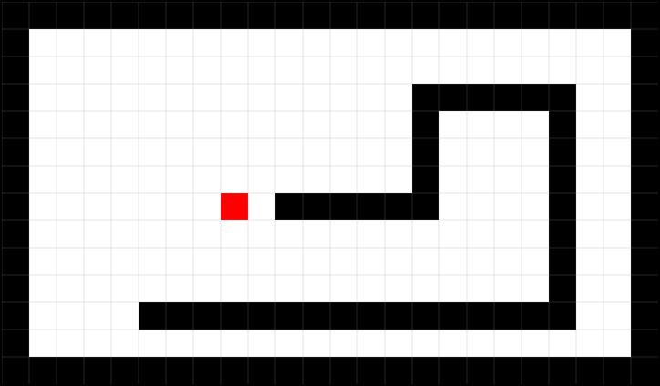
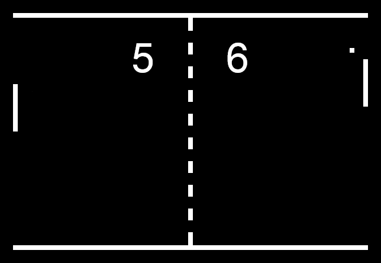

# Classic Games in Python

Classic arcade games ([PONG](http://en.wikipedia.org/wiki/Pong) and [Snake](http://en.wikipedia.org/wiki/Snake_%28video_game%29)) coded in Python during [An Introduction to Interactive Programming in Python](https://www.coursera.org/course/interactivepython) online course.

Just for fun.

## Demo

* [Snake](http://www.codeskulptor.org/#user34_mNrvr44mm2yxM3r.py)
* [Pong](http://www.codeskulptor.org/#user34_0LolfqghPDvAxxn.py)

## Requirements

* [SimpleGUITk](https://pypi.python.org/pypi/SimpleGUITk)

Optional:

* [Pillow](https://github.com/python-imaging/Pillow)
* [Pygame](http://www.pygame.org/)
* [matplotlib](http://matplotlib.org/)

## Screenshots

